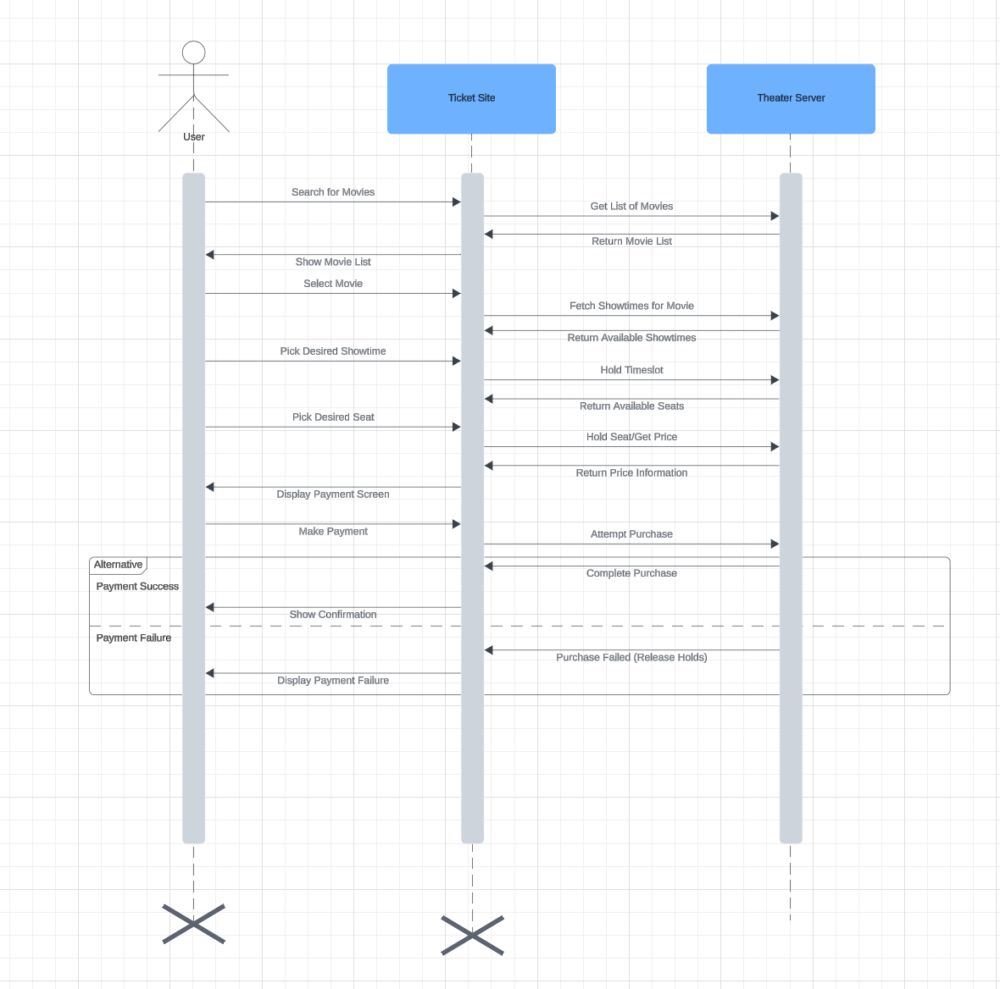

# CIS4930_movieTicketsPayments_API
Class assignment for REST API sample

Visit this page to see swagger page for payments API:
https://devdrum.github.io/CIS4930_movieTicketsPayments_API/#/Payments/post_makePayment__invoiceID_

Here is a UML Sequence Diagram for the sample movie reservation:

